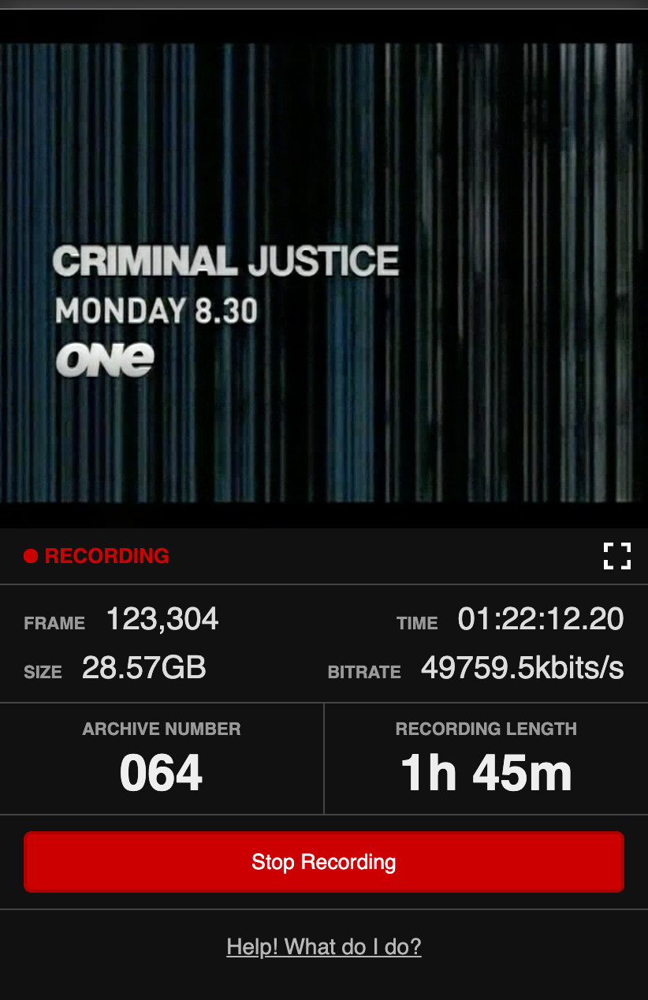

# VHS Dubbing Controller

Web-based control of an ffmpeg video capture, with a live preview in the browser using an HLS stream. Created so my parents could help me digitise ~100 VHS tapes using their phones instead of a command line.

This is written to capture a PAL 50i signal from a Black Magic Design Intensity Shuttle to lossless FFV1 MKV files, but the capture input is configurable and any ffmpeg input stream should work. Tested on Linux and Windows. My capture was done under Windows as the Intensity Shuttle unfortunately doesn't have a Linux driver.

I don't intend to maintain this project, but hopefully it serves as a useful example or starting point for someone. It's thrown together as simply as possible to get the job done, and has performed its function well.



## Requirements

- Python >= 3.6
- ffmpeg >= 4.2

On 64-bit Windows, ensure you install 64-bit Python. Messaging between the recorder thread and Tornado web-socket appears to be broken if running 32-bit Python on a 64-bit system.

On Windows, also note that`ffmpeg` is expected to be accessible on PATH.

## Usage

1. Clone/download, then install Python dependencies:

  ```bash
  pip install -r requirements.txt
  ```

2. Copy `config.example.py` to `config.py` and modify as necessary. This defines the input stream for ffmpeg.

3. Start the web-server:

  ```
  python3 server.py
  ```

4. Go to http://localhost:8000/ in a browser


## Back story

In May 2020 I flew a capture device and a handful of other light-weight equipment to my parent's home to spend 10 days archiving VHS tapes. Despite working almost non-stop, I got through just 24 of ~100 tapes in that time: 137 hours of capture.

I couldn't take 70 VHS tapes, a DVR and a VHS deck home with me on a plane, so I left a compact capture setup at my parent's place and put together this control application so they could continue the archiving without me.

### Capture equipment/setup

For completeness, here's a list of the equipment I used for archiving tapes. Bar the capture device, this was all equipment my parents already had:

- Mitsubishi HS-861V "Black Diamond" VHS deck
- Mitsubishi HS-871V "Black Diamond" VHS deck (did the first 30 tapes and now needs servicing)
- Panasonic DVR-550H HDD recorder
- Black Magic Design Intensity Shuttle USB 3 capture device

Note that the Intensity Shuttle requires quite a strong, stable signal to avoid dropping frames. Passing the VHS signals through the DVR effectively worked as a Time Base Corrector (TBC) which allowed reliable capture. Trying to capture directly from the VHS player with the Intensity Shuttle performed poorly for some tapes, resulting in a lot of black (dropped) frames in the capture.

Wiring:

```
VHS ---(composite out)---> DVR ---(S-Video out)---> Intensity Shuttle
                               ---(HDMI out)---> TV for monitoring
```

Capturing and streaming the live preview doesn't need a ton of horsepower. My capture "server" is an HP ProDesk 405 G4 Desktop Mini. This sits around 17% CPU utilisation while capturing, with a constant 7MB/s writing to disk. PAL SD capture in FFV1 is around 21.25 GiB per hour.
